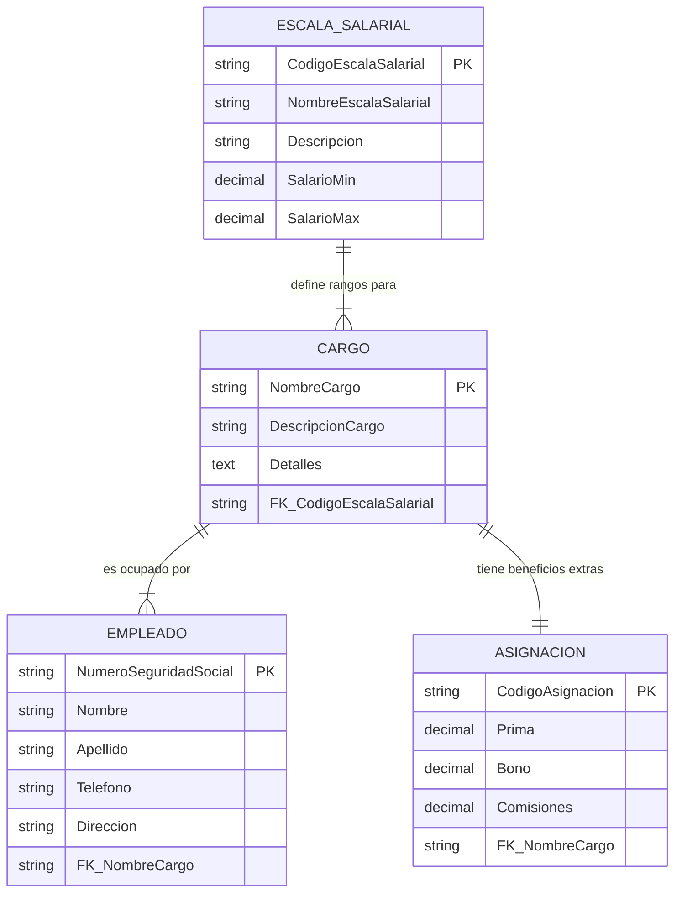

# Documentación del Diseño: Caso 1 (RRHH)

Este documento describe el esquema relacional para la gestión de empleados, cargos, escalas salariales y asignaciones monetarias adicionales, basado en el diagrama proporcionado.

## Diagrama Entidad-Relación (ER)

## Diccionario de Datos

Detalle de las tablas y atributos identificados en el diseño visual.

### 1. Escala Salarial

Define los rangos mínimos y máximos de sueldo.

| Campo | Tipo sugerido | Restricción | Descripción |
|---|---|---|---|
| CodigoEscalaSalarial | VARCHAR(10) | PK | Identificador único de la escala. |
| NombreEscalaSalarial | VARCHAR(50) |  | Nombre corto del nivel (ej. "Junior", "Senior"). |
| Descripcion | VARCHAR(255) |  | Explicación detallada del nivel. |
| SalarioMin | DECIMAL(10,2) |  | Límite inferior del rango salarial. |
| SalarioMax | DECIMAL(10,2) |  | Límite superior del rango salarial. |

### 2. Cargos

Define los puestos de trabajo disponibles en la organización.

| Campo | Tipo sugerido | Restricción | Descripción |
|---|---|---|---|
| NombreCargo | VARCHAR(50) | PK | Identificador único del cargo. |
| DescripcionCargo | VARCHAR(255) |  | Descripción de responsabilidades. |
| Detalles | TEXT |  | Información adicional del puesto. |
| CodigoEscalaSalarial | VARCHAR(10) | FK | Relación con la tabla Escala Salarial. |

### 3. Asignaciones

Contiene los beneficios monetarios adicionales fijos por cargo.  
Relación: 1 a 1 con Cargos.

| Campo | Tipo sugerido | Restricción | Descripción |
|---|---|---|---|
| CodigoAsignacion | INT | PK | Identificador único. |
| Prima | DECIMAL(10,2) |  | Monto de prima asignada. |
| Bono | DECIMAL(10,2) |  | Monto de bonificación. |
| Comisiones | DECIMAL(10,2) |  | Porcentaje o monto de comisiones. |
| NombreCargo | VARCHAR(50) | FK/UK | Relación única con la tabla Cargos. |

### 4. Empleados

Información personal de los trabajadores.

| Campo | Tipo sugerido | Restricción | Descripción |
|---|---|---|---|
| NumeroSeguridadSocial | VARCHAR(20) | PK | Identificador único (Cédula/SSN). |
| Nombre | VARCHAR(50) |  | Nombre del empleado. |
| Apellido | VARCHAR(50) |  | Apellido del empleado. |
| Telefono | VARCHAR(20) |  | Contacto telefónico. |
| Direccion | VARCHAR(100) |  | Dirección de residencia. |
| NombreCargo | VARCHAR(50) | FK | Cargo que ocupa actualmente. |

## Reglas de Negocio Identificadas

- **Cargos y salarios:** Un cargo debe tener asignada una y solo una escala salarial (relación obligatoria del lado del cargo).
- **Beneficios:** Un cargo tiene exactamente una configuración de asignaciones (Prima, Bono, Comisiones).
- **Ocupación:** Un cargo puede estar vacante (cero empleados) o tener múltiples empleados (cero a muchos).
- **Unicidad:** Un empleado solo puede ocupar un cargo a la vez.
