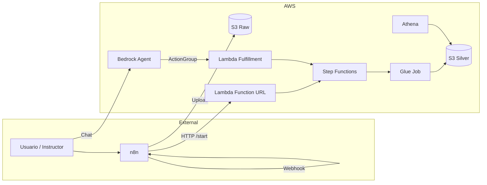

# Arquitectura de referencia

```mermaid
flowchart LR
  subgraph External
    N8N[n8n]:::box
    User[Usuario / Instructor]:::box
  end

  subgraph AWS
    S3raw[(S3 Raw)]:::data
    S3silver[(S3 Silver)]:::data
    Glue[Glue Job]:::compute
    SFN[Step Functions]:::compute
    Athena[Athena]:::compute
    Bedrock[Bedrock Agent]:::compute
    Bridge[Lambda Function URL]:::compute
    Fulfill[Lambda Fulfillment]:::compute
  end

  User --> N8N
  N8N -->|Webhook| N8N
  N8N -->|Upload| S3raw
  N8N -->|HTTP /start| Bridge
  Bridge --> SFN
  SFN --> Glue
  Glue --> S3silver
  Athena --> S3silver

  User -->|Chat| Bedrock
  Bedrock -->|ActionGroup| Fulfill
  Fulfill --> SFN

classDef box stroke-width:1px;
classDef data stroke-width:1px;
classDef compute stroke-width:1px;
```
